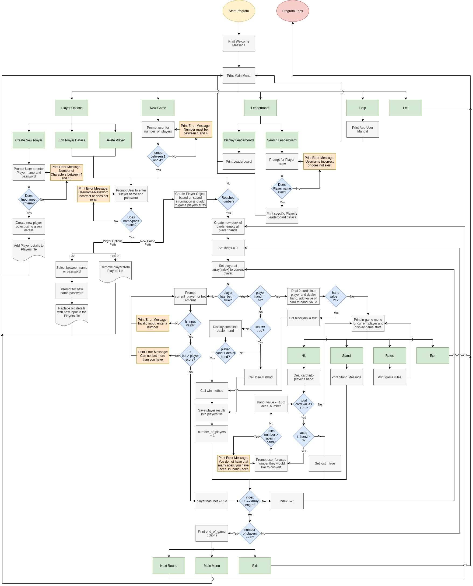

# T1A3 Terminal Application
Card Game Application
By Christopher Murray Gibson 2020

## Index
| |
| - |
|[Software Development Plan](#software-development-plan)|
|[Purpose and Scope](#purpose-and-scope)|
|[Problem](#problem)|
|[Target Audience](#target-audience)|
|[How it is Used](#how-it-is-used)|
|[Features](#features)|
|[Player Features](#player-features)|
|[Game Features](#game-features)|
|[Leaderboard Features](#leaderboard-features)|
|[Help Features](#help-features)|
|[User Interaction Outline](#user-interaction-outline)|
|[Help Documentation](#help-documentation)|
|[Control Flow Diagram](#control-flow-diagram)|
|[Implementation Plan](#implementation-plan)|
|[Source Control Repository](#source-control-repository)|
| |

# Software Development Plan
## Purpose and Scope
The application will be a playable card game using Blackjack rules. The minimum viable product will include a numbers only version of the game with no visual elements besides displaying the numbers. The application will also allow the user to create players, edit their details, delete them from the player file, and create leaderboard tables either of all players or a specific one. This way players can see who the best of the best are and be motivated to play more games.

## Problem
It will solve people's need for entertainment while working within terminals. I am developing it both to fill that need and develop my ruby programming/testing skills.

## Target Audience
The target audience are those that enjoy card games of this nature, especially developers that use terminal a lot and need a break from their work.

## How it is Used
A member of the target audience will use this app to entertain themselves by playing games of Blackjack either solo or with other players against the dealer on the same machine. They can navigate the menus/options using their arrow and Enter keys. They will be able to create players by giving them a name and password, as well as editing or deleting those details of a given player after a check. They can view the leaderboard for all players or a specific one. Finally they can play a simplified game of Blackjack either solo or with others against a dealers hand. They use their score to make bets. If they lose their bet is forfeit, otherwise they gain back double. If they get 21 on the first go they get back double and a half and win automatically.

# Features
## Player Features
### Create Player
Requires user to enter name and password to create a player object that is saved in a player file.
### Edit Player details
Allows user to edit the name/password if the name/password they enter are correct.
### Delete Player
Allows user to delete the player from the player file if the name/password they enter are correct.

## Game Features
### Deck Builder
When a new game is made, a deck of values of Blackjack cards is created and shuffled.
### Draw Card
Draws a card and puts the value of it in the player's or dealer's hand value variable.
### Bet
A player bets before the cards are dealt. They can bet using their score and can not bet lower than 0.
### Hit
Draws a card and adds the value of it to the hand value variable of the player. If the value added was an 11 an increment of 1 is added to the aces in hand variable. If the hand value is higher than 21 the aces in hand variable is checked. If it is greater than 0 then the hand value variable is decremented by 10 and the aces in hand variable is decremented by 1. Otherwise the player loses the round.
### Stand
The player passes their turn to the next player and maintains their hand value. It is then compared against the dealers hand and the greater hand wins, a draw means the player gets their bet back.

## Leaderboard Features
### Display Leaderboard
Display all players in player file into a Leaderboard table.
### Search Leaderboard details for specific player
Allows user to enter the name of a player to Display a Leaderboard table of their specific details.

## Help Features
### Display Information about how to operate program
Shows text from a help file highlighting controls for the program and types of inputs the user can enter.
### Display Information about game rules
Shows text from a rules file highlighting the rules of the card game.

# User Interaction Outline
User navigates menus using arrows and Enter keys. A built in prompt message explains this on each menu. If input by the user is required the application will prompt the user for the required input and run a check on the input. User can access help/rules files that describe what to do should they need it. If a user enters an incorrect input they will receive a red coloured text message stating that fact. They are sent back to the menu they were on previously to try again. Green coloured text messages indicate a successful input.

# Help Documentation
## Installation

type ./run_app.sh
## Required Dependencies
### Gems
gem "pastel", "~> 0.8.0"
gem "rspec", "~> 3.10"
gem "tty-color", "~> 0.6.0"
gem "tty-cursor", "~> 0.7.1"
gem "tty-font", "~> 0.5.0"
gem "tty-prompt", "~> 0.23.0"
gem "tty-reader", "~> 0.9.0"
gem "tty-screen", "~> 0.8.1"
gem "tty-table", "~> 0.12.0"
gem "wisper", "~> 2.0"

## System/Hardware Requirements
Most systems and hardware configurations with access to the bash terminal and Ruby version 2.7.2 using either Linux/Mac/Windows operating systems should be sufficient to run this program. This program was originally tested on a Ubuntu Linux distro.

# Control Flow Diagram

# Implementation Plan
Below is a link to my Trello Board for the development of this terminal application:
[Trello Board](https://trello.com/b/YOqtuuu1/cmgterminalapp)

Quite a bit has changed since that initial design. A lot of the methods have changed but the overall features are still in place.

# Source Control Repository
Below is a link to my Github repository for the source control management of this terminal application:
[Github Repo](https://github.com/chris-gibs/CardGameApp)